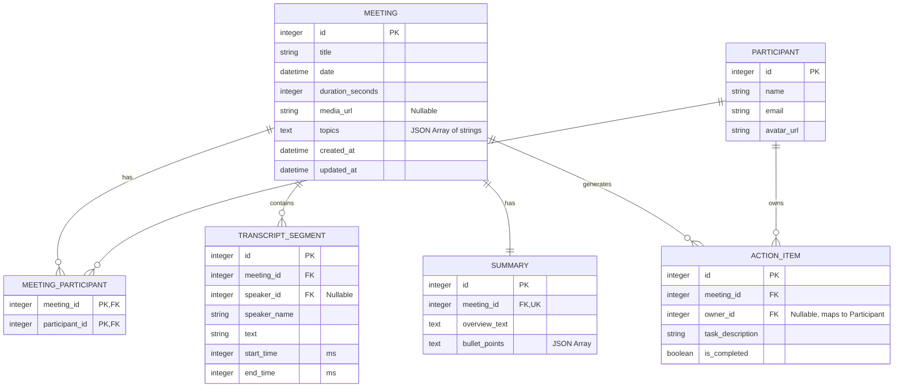

# Database Schema Design

## Overview
The application uses SQLite with SQLAlchemy as the ORM. The schema represents Meetings, Participants, Transcripts, Summaries, and Action Items.

## Entity Relationship Diagram (ERD)

## Schema Details

### 1. `meetings`
- `id` (Integer, Primary Key)
- `title` (String, Not Null)
- `date` (DateTime, Not Null)
- `duration_seconds` (Integer, Not Null)
- `media_url` (String, Nullable)
- `topics` (Text, Nullable) - Stored as a JSON array of strings (simplified schema).
- `created_at` (DateTime, default=now)
- `updated_at` (DateTime, default=now, onupdate=now)

### 2. `participants`
- `id` (Integer, Primary Key)
- `name` (String, Not Null)
- `email` (String, Unique, Nullable)
- `avatar_url` (String, Nullable)

### 3. `meeting_participants`
- `meeting_id` (Integer, FK -> meetings.id)
- `participant_id` (Integer, FK -> participants.id)

### 4. `transcript_segments`
- `id` (Integer, Primary Key)
- `meeting_id` (Integer, FK -> meetings.id, Indexed)
- `speaker_id` (Integer, FK -> participants.id, Nullable)
- `speaker_name` (String, Not Null)
- `text` (Text, Not Null)
- `start_time` (Integer, Not Null)
- `end_time` (Integer, Not Null)

### 5. `summaries`
- `id` (Integer, Primary Key)
- `meeting_id` (Integer, FK -> meetings.id, Unique)
- `overview_text` (Text, Nullable)
- `bullet_points` (Text, Nullable) - JSON array of strings.

### 6. `action_items`
- `id` (Integer, Primary Key)
- `meeting_id` (Integer, FK -> meetings.id, Indexed)
- `owner_id` (Integer, FK -> participants.id, Nullable) - Added ownership field.
- `task_description` (String, Not Null)
- `is_completed` (Boolean, default=False)

## Relationships
- **Meeting** `<->` **Participants**: Many-to-Many.
- **Meeting** `->` **Transcript Segments**: One-to-Many. Cascade delete.
- **Meeting** `->` **Summary**: One-to-One. Cascade delete.
- **Meeting** `->` **Action Items**: One-to-Many. Cascade delete.
- **Participant** `->` **Action Items**: One-to-Many.

## Index Strategy
- `transcript_segments.meeting_id`, `action_items.meeting_id`, `meetings.date`.
